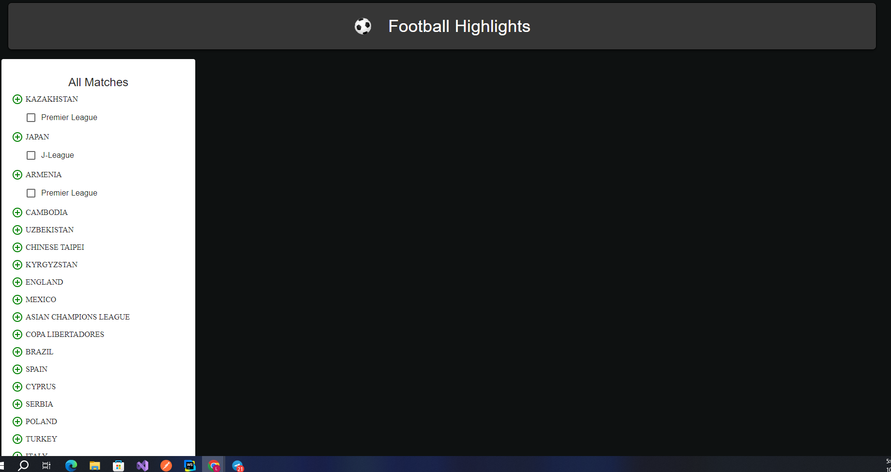
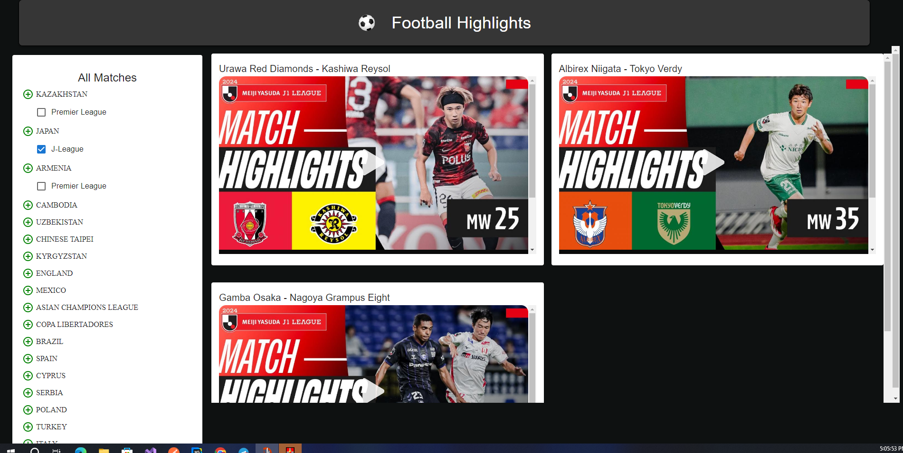

# Footbalee - Football Matches Viewer Ap

Footbalee is a React application that fetches live football match videos from a REST API and displays them. Users can browse matches by country and league, select specific matches, and watch embedded videos of the selected games

# Features
    Fetches live football match videos from a REST API
    Categorizes matches by country and league
    Allows users to select matches and view embedded videos
    User-friendly UI built with Material-UI
    Responsive design.

# Screenshots

# Built With
    React - JavaScript library for building user interfaces
    Material-UI - A popular React UI framework
    RapidAPI - API provider for fetching live football videos.

# Getting Started

    Follow these instructions to get a copy of the project up and running on your local machine.
    
    Prerequisites
    You will need the following software installed:
    
    Node.js - JavaScript runtime
    npm - Node package manager (comes with Node.js)